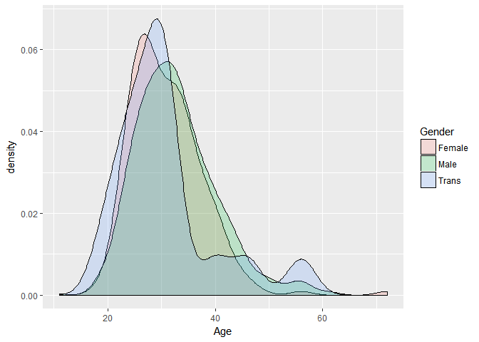
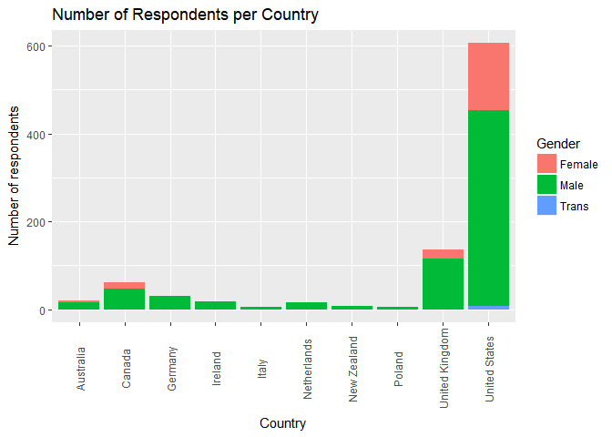
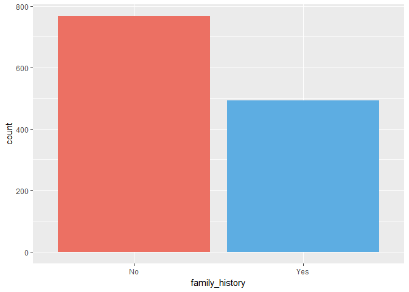
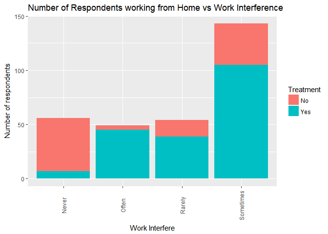
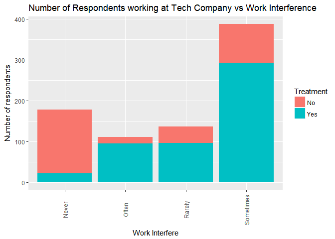
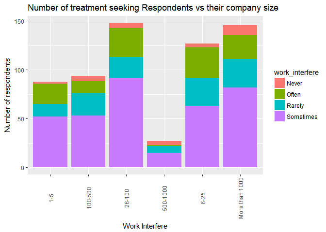

Mental Health Analysis
================
Niket Choudhary
July 28, 2018

``` r
mhealth <- read.csv(file.choose(), header = TRUE, na.strings = c("NA", "", " ", "."))
```

``` r
summary(mhealth)
```

    ##                Timestamp         Age                 Gender   
    ##  2014-08-27 12:31:41:   2   Min.   :-1.726e+03   Male   :615  
    ##  2014-08-27 12:37:50:   2   1st Qu.: 2.700e+01   male   :206  
    ##  2014-08-27 12:43:28:   2   Median : 3.100e+01   Female :121  
    ##  2014-08-27 12:44:51:   2   Mean   : 7.943e+07   M      :116  
    ##  2014-08-27 12:54:11:   2   3rd Qu.: 3.600e+01   female : 62  
    ##  2014-08-27 14:22:43:   2   Max.   : 1.000e+11   F      : 38  
    ##  (Other)            :1247                        (Other):101  
    ##            Country        state     self_employed family_history treatment
    ##  United States :751   CA     :138   No  :1095     No :767        No :622  
    ##  United Kingdom:185   WA     : 70   Yes : 146     Yes:492        Yes:637  
    ##  Canada        : 72   NY     : 57   NA's:  18                             
    ##  Germany       : 45   TN     : 45                                         
    ##  Ireland       : 27   TX     : 44                                         
    ##  Netherlands   : 27   (Other):390                                         
    ##  (Other)       :152   NA's   :515                                         
    ##    work_interfere         no_employees remote_work tech_company
    ##  Never    :213    1-5           :162   No :883     No : 228    
    ##  Often    :144    100-500       :176   Yes:376     Yes:1031    
    ##  Rarely   :173    26-100        :289                           
    ##  Sometimes:465    500-1000      : 60                           
    ##  NA's     :264    6-25          :290                           
    ##                   More than 1000:282                           
    ##                                                                
    ##        benefits     care_options   wellness_program      seek_help  
    ##  Don't know:408   No      :501   Don't know:188     Don't know:363  
    ##  No        :374   Not sure:314   No        :842     No        :646  
    ##  Yes       :477   Yes     :444   Yes       :229     Yes       :250  
    ##                                                                     
    ##                                                                     
    ##                                                                     
    ##                                                                     
    ##       anonymity                  leave     mental_health_consequence
    ##  Don't know:819   Don't know        :563   Maybe:477                
    ##  No        : 65   Somewhat difficult:126   No   :490                
    ##  Yes       :375   Somewhat easy     :266   Yes  :292                
    ##                   Very difficult    : 98                            
    ##                   Very easy         :206                            
    ##                                                                     
    ##                                                                     
    ##  phys_health_consequence        coworkers          supervisor 
    ##  Maybe:273               No          :260   No          :393  
    ##  No   :925               Some of them:774   Some of them:350  
    ##  Yes  : 61               Yes         :225   Yes         :516  
    ##                                                               
    ##                                                               
    ##                                                               
    ##                                                               
    ##  mental_health_interview phys_health_interview  mental_vs_physical
    ##  Maybe: 207              Maybe:557             Don't know:576     
    ##  No   :1008              No   :500             No        :340     
    ##  Yes  :  44              Yes  :202             Yes       :343     
    ##                                                                   
    ##                                                                   
    ##                                                                   
    ##                                                                   
    ##  obs_consequence
    ##  No :1075       
    ##  Yes: 184       
    ##                 
    ##                 
    ##                 
    ##                 
    ##                 
    ##                                                                                                                                                                                                         comments   
    ##  * Small family business - YMMV.                                                                                                                                                                            :   5  
    ##  -                                                                                                                                                                                                          :   1  
    ##  (yes but the situation was unusual and involved a change in leadership at a very high level in the organization as well as an extended leave of absence)                                                   :   1  
    ##  A close family member of mine struggles with mental health so I try not to stigmatize it. My employers/coworkers also seem compassionate toward any kind of health or family needs.                        :   1  
    ##  A co-worker recently had mental health issues and my employer was very reasonable with them I don't know the full story but I do know that he was given ample time off and eased back in to the work place.:   1  
    ##  (Other)                                                                                                                                                                                                    : 154  
    ##  NA's                                                                                                                                                                                                       :1096

``` r
str(mhealth)
```

    ## 'data.frame':    1259 obs. of  27 variables:
    ##  $ Timestamp                : Factor w/ 1246 levels "2014-08-27 11:29:31",..: 1 2 3 4 5 6 7 8 9 10 ...
    ##  $ Age                      : num  37 44 32 31 31 33 35 39 42 23 ...
    ##  $ Gender                   : Factor w/ 49 levels "A little about you",..: 16 24 30 30 30 30 16 24 16 30 ...
    ##  $ Country                  : Factor w/ 48 levels "Australia","Austria",..: 46 46 8 45 46 46 46 8 46 8 ...
    ##  $ state                    : Factor w/ 45 levels "AL","AZ","CA",..: 11 12 NA NA 38 37 19 NA 11 NA ...
    ##  $ self_employed            : Factor w/ 2 levels "No","Yes": NA NA NA NA NA NA NA NA NA NA ...
    ##  $ family_history           : Factor w/ 2 levels "No","Yes": 1 1 1 2 1 2 2 1 2 1 ...
    ##  $ treatment                : Factor w/ 2 levels "No","Yes": 2 1 1 2 1 1 2 1 2 1 ...
    ##  $ work_interfere           : Factor w/ 4 levels "Never","Often",..: 2 3 3 2 1 4 4 1 4 1 ...
    ##  $ no_employees             : Factor w/ 6 levels "1-5","100-500",..: 5 6 5 3 2 5 1 1 2 3 ...
    ##  $ remote_work              : Factor w/ 2 levels "No","Yes": 1 1 1 1 2 1 2 2 1 1 ...
    ##  $ tech_company             : Factor w/ 2 levels "No","Yes": 2 1 2 2 2 2 2 2 2 2 ...
    ##  $ benefits                 : Factor w/ 3 levels "Don't know","No",..: 3 1 2 2 3 3 2 2 3 1 ...
    ##  $ care_options             : Factor w/ 3 levels "No","Not sure",..: 2 1 1 3 1 2 1 3 3 1 ...
    ##  $ wellness_program         : Factor w/ 3 levels "Don't know","No",..: 2 1 2 2 1 2 2 2 2 1 ...
    ##  $ seek_help                : Factor w/ 3 levels "Don't know","No",..: 3 1 2 2 1 1 2 2 2 1 ...
    ##  $ anonymity                : Factor w/ 3 levels "Don't know","No",..: 3 1 1 2 1 1 2 3 2 1 ...
    ##  $ leave                    : Factor w/ 5 levels "Don't know","Somewhat difficult",..: 3 1 2 2 1 1 2 1 4 1 ...
    ##  $ mental_health_consequence: Factor w/ 3 levels "Maybe","No","Yes": 2 1 2 3 2 2 1 2 1 2 ...
    ##  $ phys_health_consequence  : Factor w/ 3 levels "Maybe","No","Yes": 2 2 2 3 2 2 1 2 2 2 ...
    ##  $ coworkers                : Factor w/ 3 levels "No","Some of them",..: 2 1 3 2 2 3 2 1 3 3 ...
    ##  $ supervisor               : Factor w/ 3 levels "No","Some of them",..: 3 1 3 1 3 3 1 1 3 3 ...
    ##  $ mental_health_interview  : Factor w/ 3 levels "Maybe","No","Yes": 2 2 3 1 3 2 2 2 2 1 ...
    ##  $ phys_health_interview    : Factor w/ 3 levels "Maybe","No","Yes": 1 2 3 1 3 1 2 2 1 1 ...
    ##  $ mental_vs_physical       : Factor w/ 3 levels "Don't know","No",..: 3 1 2 2 1 1 1 2 2 3 ...
    ##  $ obs_consequence          : Factor w/ 2 levels "No","Yes": 1 1 1 2 1 1 1 1 1 1 ...
    ##  $ comments                 : Factor w/ 159 levels "-","(yes but the situation was unusual and involved a change in leadership at a very high level in the organization"| __truncated__,..: NA NA NA NA NA NA NA NA NA NA ...

At first glance the data requires a good amount of cleaning. Let's take it step by step.

------------------------------------------------------------------------

First we can see that the Timestamp is nearly unique with about 10 repetations, but it desn't matter. Data is arranged over date. We can consider it to be unique person. Also let's look at the span

``` r
head(mhealth$Timestamp, 2)
```

    ## [1] 2014-08-27 11:29:31 2014-08-27 11:29:37
    ## 1246 Levels: 2014-08-27 11:29:31 2014-08-27 11:29:37 ... 2016-02-01 23:04:31

``` r
tail(mhealth$Timestamp, 2)
```

    ## [1] 2015-11-30 21:25:06 2016-02-01 23:04:31
    ## 1246 Levels: 2014-08-27 11:29:31 2014-08-27 11:29:37 ... 2016-02-01 23:04:31

This data is from 2014-08-27 to 2016-02-01, around 15 months. The timespan does not matter for our Data Analysis.

------------------------------------------------------------------------

Let's see the missing data in every column

``` r
sapply(mhealth, function(x) sum(is.na(x)))
```

    ##                 Timestamp                       Age 
    ##                         0                         0 
    ##                    Gender                   Country 
    ##                         0                         0 
    ##                     state             self_employed 
    ##                       515                        18 
    ##            family_history                 treatment 
    ##                         0                         0 
    ##            work_interfere              no_employees 
    ##                       264                         0 
    ##               remote_work              tech_company 
    ##                         0                         0 
    ##                  benefits              care_options 
    ##                         0                         0 
    ##          wellness_program                 seek_help 
    ##                         0                         0 
    ##                 anonymity                     leave 
    ##                         0                         0 
    ## mental_health_consequence   phys_health_consequence 
    ##                         0                         0 
    ##                 coworkers                supervisor 
    ##                         0                         0 
    ##   mental_health_interview     phys_health_interview 
    ##                         0                         0 
    ##        mental_vs_physical           obs_consequence 
    ##                         0                         0 
    ##                  comments 
    ##                      1096

We could drop work\_interfere, but I wan't to perform my analysis and prediction around this variable.

Also, consider only rows with work\_interfere data

``` r
mhealth_1 <- mhealth[!is.na(mhealth$work_interfere),]
```

Well, we should drop Comments and State column.

``` r
mhealth_1$comments <- NULL
mhealth_1$state <- NULL
```

Let's look at self\_employed

``` r
summary(mhealth_1$self_employed)
```

    ##   No  Yes NA's 
    ##  852  125   18

Well, we can fill the missing values with No

``` r
mhealth_1$self_employed[is.na(mhealth_1$self_employed)] <- 'No'
```

``` r
sapply(mhealth_1, function(x) sum(is.na(x)))
```

    ##                 Timestamp                       Age 
    ##                         0                         0 
    ##                    Gender                   Country 
    ##                         0                         0 
    ##             self_employed            family_history 
    ##                         0                         0 
    ##                 treatment            work_interfere 
    ##                         0                         0 
    ##              no_employees               remote_work 
    ##                         0                         0 
    ##              tech_company                  benefits 
    ##                         0                         0 
    ##              care_options          wellness_program 
    ##                         0                         0 
    ##                 seek_help                 anonymity 
    ##                         0                         0 
    ##                     leave mental_health_consequence 
    ##                         0                         0 
    ##   phys_health_consequence                 coworkers 
    ##                         0                         0 
    ##                supervisor   mental_health_interview 
    ##                         0                         0 
    ##     phys_health_interview        mental_vs_physical 
    ##                         0                         0 
    ##           obs_consequence 
    ##                         0

So, we are done dealing with missing values

------------------------------------------------------------------------

Let's look at Age

``` r
summary(as.factor(mhealth_1$Age))
```

    ##       -1726          -1           8          11          18          19 
    ##           1           1           1           1           5           6 
    ##          20          21          22          23          24          25 
    ##           5          14          15          41          32          46 
    ##          26          27          28          29          30          31 
    ##          60          52          54          62          52          50 
    ##          32          33          34          35          36          37 
    ##          68          52          53          45          33          34 
    ##          38          39          40          41          42          43 
    ##          31          26          29          18          18          20 
    ##          44          45          46          47          48          49 
    ##           9          11          11           1           5           4 
    ##          50          51          53          54          55          56 
    ##           4           4           1           3           3           4 
    ##          57          58          60          61          62          72 
    ##           3           1           1           1           1           1 
    ##         329 99999999999 
    ##           1           1

First two, and last do data are incorrect, let's replace them with modearte values

``` r
mhealth_1$Age[which(mhealth_1$Age < 0)] <- 19 # 19 and 56 have maximum people in that limited group
mhealth_1$Age[which(mhealth_1$Age > 100)] <- 56 
```

``` r
summary(mhealth_1$Age)
```

    ##    Min. 1st Qu.  Median    Mean 3rd Qu.    Max. 
    ##     8.0    27.0    31.0    32.3    36.0    72.0

------------------------------------------------------------------------

Looking at Gender

``` r
summary(mhealth_1$Gender)
```

    ##                             A little about you 
    ##                                              1 
    ##                                        Agender 
    ##                                              1 
    ##                                            All 
    ##                                              1 
    ##                                      Androgyne 
    ##                                              1 
    ##                               cis-female/femme 
    ##                                              1 
    ##                                     Cis Female 
    ##                                              1 
    ##                                       cis male 
    ##                                              1 
    ##                                       Cis Male 
    ##                                              2 
    ##                                        Cis Man 
    ##                                              1 
    ##                                           Enby 
    ##                                              1 
    ##                                              f 
    ##                                             13 
    ##                                              F 
    ##                                             31 
    ##                                         femail 
    ##                                              1 
    ##                                         Femake 
    ##                                              0 
    ##                                         female 
    ##                                             53 
    ##                                         Female 
    ##                                            106 
    ##                                        Female  
    ##                                              2 
    ##                                   Female (cis) 
    ##                                              1 
    ##                                 Female (trans) 
    ##                                              2 
    ##                                          fluid 
    ##                                              1 
    ##                                    Genderqueer 
    ##                                              1 
    ##                                 Guy (-ish) ^_^ 
    ##                                              1 
    ##                                              m 
    ##                                             23 
    ##                                              M 
    ##                                             87 
    ##                                           Mail 
    ##                                              1 
    ##                                          maile 
    ##                                              0 
    ##                                           Make 
    ##                                              4 
    ##                                            Mal 
    ##                                              1 
    ##                                           male 
    ##                                            157 
    ##                                           Male 
    ##                                            481 
    ##                                       Male-ish 
    ##                                              1 
    ##                                          Male  
    ##                                              3 
    ##                                     Male (CIS) 
    ##                                              0 
    ##                       male leaning androgynous 
    ##                                              1 
    ##                                           Malr 
    ##                                              1 
    ##                                            Man 
    ##                                              0 
    ##                                           msle 
    ##                                              1 
    ##                                            Nah 
    ##                                              1 
    ##                                         Neuter 
    ##                                              1 
    ##                                     non-binary 
    ##                                              1 
    ## ostensibly male, unsure what that really means 
    ##                                              1 
    ##                                              p 
    ##                                              1 
    ##                                          queer 
    ##                                              1 
    ##                                 queer/she/they 
    ##                                              1 
    ##                          something kinda male? 
    ##                                              0 
    ##                                   Trans-female 
    ##                                              1 
    ##                                    Trans woman 
    ##                                              1 
    ##                                          woman 
    ##                                              1 
    ##                                          Woman 
    ##                                              1

This is too bad data column!! Let's clean this

``` r
male <- c("cis male", "Cis Male", "Cis Man", "m", "M", "Mail", "maile", "Make", "Mal", "male", "Male", "Male-ish", "Male ", "Male (CIS)", "Malr", "Man", "msle")

trans <- c("Agender", "All", "Androgyne", "Enby", "Female (trans)", "fluid", "Genderqueer", "male leaning androgynous", "Nah", "Neuter", "non-binary", "ostensibly male, unsure what that really means", "queer", "queer/she/they", "something kinda male?", "Trans-female", "Trans woman")

female <- c("cis-female/femme", "Cis Female", "f", "F", "femail",  "Femake", "female", "Female", "Female ", "Female (cis)", "woman", "Woman")
```

``` r
mhealth_1$Gender <- sapply(as.character(mhealth_1$Gender), function(x) if(x %in% male) "Male" else x )
mhealth_1$Gender <- sapply(as.character(mhealth_1$Gender), function(x) if(x %in% female) "Female" else x )
mhealth_1$Gender <- sapply(as.character(mhealth_1$Gender), function(x) if(x %in% trans) "Trans" else x )
```

Dropping rest three gender types, as they are impossible to comprehend

``` r
mhealth_1 <- mhealth_1[!mhealth_1$Gender == "p",]
mhealth_1 <- mhealth_1[!mhealth_1$Gender == "Guy (-ish) ^_^",]
mhealth_1 <- mhealth_1[!mhealth_1$Gender == "A little about you",]
```

``` r
summary(as.factor(mhealth_1$Gender))
```

    ## Female   Male  Trans 
    ##    211    764     17

Store this in new data frame

``` r
mhealth_2 <- mhealth_1
```

download

``` r
write.csv(mhealth_2, "mhealth_2.csv", row.names=FALSE)
```

------------------------------------------------------------------------

Now let's analyse our data and find insights

``` r
library(ggplot2)

ggplot(mhealth_2, aes(Age)) +
  geom_density(aes(fill = Gender), alpha=0.2)
```

 Well, most of them are facing these issues between age of 20 to 45, which is the working age

``` r
x <- aggregate(Timestamp ~ Country + as.factor(Gender) , data = mhealth_2, length)
x <- x[with(x,order(-Timestamp)),]
x <- x[1:15,]
```

Look at the data of countries with most respondents

``` r
ggplot(x, aes(x = Country, y = Timestamp)) + 
  geom_bar(aes(fill = x$`as.factor(Gender)`), stat = "identity") +
  xlab("Country") + ylab("Number of respondents") + labs(title = "Number of Respondents per Country", fill="Gender") +
  theme(axis.text.x = element_text(angle = 90, vjust = 0.5))
```

 Most of our data is from USA and UK

How many had a family history of mental illness

``` r
ggplot(mhealth, aes(family_history)) +
  geom_bar(fill = c("#EC7063", "#5DADE2"))
```

 Most of them did not have, but a significant amount of them had a history of mental illness

Let's look at People who do remote work and have work interfere and take a treatment

``` r
y <- aggregate(Timestamp ~ remote_work + work_interfere + treatment, data = mhealth_2, length)
y <- y[y$remote_work == "Yes",]
```

``` r
ggplot(y, aes(x = work_interfere, y = Timestamp)) + 
  geom_bar(aes(fill = treatment), stat = "identity") +
  xlab("Work Interfere") + ylab("Number of respondents") + labs(title = "Number of Respondents working from Home vs Work Interference", fill="Treatment") +
  theme(axis.text.x = element_text(angle = 90, vjust = 0.5))
```

 The scale of treatment is propotional to severity of Work Interference

Let's look at People who do work for technical company and have work interfere and take a treatment

``` r
z <- aggregate(Timestamp ~ tech_company + work_interfere + treatment, data = mhealth_2, length)
z <- z[z$tech_company == "Yes",]
```

``` r
ggplot(z, aes(x = work_interfere, y = Timestamp)) + 
  geom_bar(aes(fill = treatment), stat = "identity") +
  xlab("Work Interfere") + ylab("Number of respondents") + labs(title = "Number of Respondents working at Tech Company vs Work Interference", fill="Treatment") +
  theme(axis.text.x = element_text(angle = 90, vjust = 0.5))
```

 The scale of treatment is propotional to severity of Work Interference

Let's look at company size and how many have work interfere and take a treatment

``` r
w <- aggregate(Timestamp ~ no_employees + work_interfere + treatment, data = mhealth_2, length)
w <- w[w$treatment == "Yes",]
```

``` r
ggplot(w, aes(x = no_employees, y = Timestamp)) + 
  geom_bar(aes(fill = work_interfere), stat = "identity") +
  xlab("Work Interfere") + ylab("Number of respondents") + labs(title = "Number of treatment seeking Respondents vs their company size", fill="work_interfere") +
  theme(axis.text.x = element_text(angle = 90, vjust = 0.5))
```

 Most of our respondents are having work intreference, and the size of the company doesn' seem to be much affecting their condition

------------------------------------------------------------------------

``` r
mhealth_2$Timestamp <- NULL # drop this
```

Let's build prediction models. To quantify the burden of mental illness I will consider Work\_interfere column as my dependent variable. I will scale it.

``` r
levels(mhealth_2$work_interfere)[levels(mhealth_2$work_interfere) == "Never"] <- '0'
levels(mhealth_2$work_interfere)[levels(mhealth_2$work_interfere) == "Rarely"] <- '1'
levels(mhealth_2$work_interfere)[levels(mhealth_2$work_interfere) == "Sometimes"] <- '2'
levels(mhealth_2$work_interfere)[levels(mhealth_2$work_interfere) == "Often"] <- '3'
```

``` r
mhealth_2$Gender <- as.factor(mhealth_2$Gender)
```

``` r
write.csv(mhealth_2, "mhealth_2.csv", row.names = F)
```

------------------------------------------------------------------------
