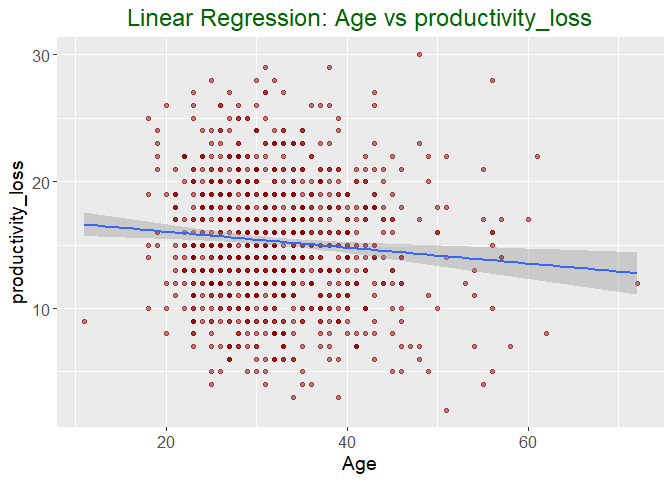
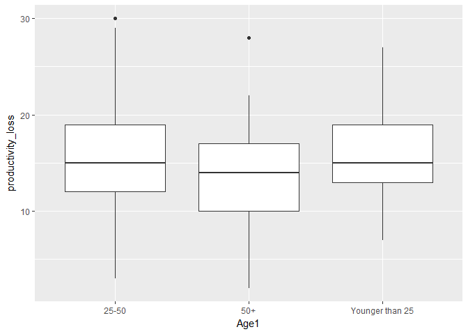
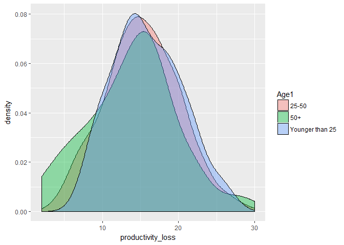

Mental\_Health\_Cal\_Productivity\_Lost
================
Niket Choudhary
August 5, 2018

``` r
mhealth_2 <- read.csv(file.choose(), header = TRUE, na.strings = c("NA", "", " ", "."))
```

``` r
summary(mhealth_2)
```

    ##       Age           Gender              Country    self_employed
    ##  Min.   :11.00   Female:211   United States :606   No :869      
    ##  1st Qu.:27.00   Male  :764   United Kingdom:141   Yes:123      
    ##  Median :31.50   Trans : 17   Canada        : 62                
    ##  Mean   :32.33                Germany       : 33                
    ##  3rd Qu.:36.00                Ireland       : 23                
    ##  Max.   :72.00                Australia     : 20                
    ##                               (Other)       :107                
    ##  family_history treatment work_interfere          no_employees remote_work
    ##  No :546        No :362   Min.   :0.000   1-5           :140   No :690    
    ##  Yes:446        Yes:630   1st Qu.:1.000   100-500       :139   Yes:302    
    ##                           Median :2.000   26-100        :229              
    ##                           Mean   :1.539   500-1000      : 44              
    ##                           3rd Qu.:2.000   6-25          :219              
    ##                           Max.   :3.000   More than 1000:221              
    ##                                                                           
    ##  tech_company       benefits     care_options   wellness_program
    ##  No :179      Don't know:294   No      :371   Don't know:136    
    ##  Yes:813      No        :295   Not sure:231   No        :663    
    ##               Yes       :403   Yes     :390   Yes       :193    
    ##                                                                 
    ##                                                                 
    ##                                                                 
    ##                                                                 
    ##       seek_help        anonymity                  leave    
    ##  Don't know:274   Don't know:636   Don't know        :422  
    ##  No        :508   No        : 57   Somewhat difficult:111  
    ##  Yes       :210   Yes       :299   Somewhat easy     :213  
    ##                                    Very difficult    : 91  
    ##                                    Very easy         :155  
    ##                                                            
    ##                                                            
    ##  mental_health_consequence phys_health_consequence        coworkers  
    ##  Maybe:381                 Maybe:221               No          :205  
    ##  No   :354                 No   :715               Some of them:610  
    ##  Yes  :257                 Yes  : 56               Yes         :177  
    ##                                                                      
    ##                                                                      
    ##                                                                      
    ##                                                                      
    ##         supervisor  mental_health_interview phys_health_interview
    ##  No          :320   Maybe:150               Maybe:444            
    ##  Some of them:288   No   :809               No   :394            
    ##  Yes         :384   Yes  : 33               Yes  :154            
    ##                                                                  
    ##                                                                  
    ##                                                                  
    ##                                                                  
    ##   mental_vs_physical obs_consequence
    ##  Don't know:436      No :827        
    ##  No        :288      Yes:165        
    ##  Yes       :268                     
    ##                                     
    ##                                     
    ##                                     
    ## 

------------------------------------------------------------------------

Let's convert factors to 0 and 1 and 2 depending on their effects

``` r
# self_employed Are you self-employed? Yes : 0, No : 1

levels(mhealth_2$self_employed)[levels(mhealth_2$self_employed) == "Yes"] <- '0'
levels(mhealth_2$self_employed)[levels(mhealth_2$self_employed) == "No"] <- '1'


# family_history Do you have a family history of mental illness? Yes : 1, No : 0

levels(mhealth_2$family_history)[levels(mhealth_2$family_history) == "No"] <- '0'
levels(mhealth_2$family_history)[levels(mhealth_2$family_history) == "Yes"] <- '1'

# treatment Have you sought treatment for a mental health condition? Yes : 0, No : 1

levels(mhealth_2$treatment)[levels(mhealth_2$treatment) == "Yes"] <- '0'
levels(mhealth_2$treatment)[levels(mhealth_2$treatment) == "No"] <- '1'


# work_interfere

mhealth_2$work_interfere <- as.factor(mhealth_2$work_interfere) 


# no_employeesHow many employees does your company or organization have? Leave this

# remote_work Do you work remotely (outside of an office) at least 50% of the time? Yes : 0, No : 1

levels(mhealth_2$remote_work)[levels(mhealth_2$remote_work) == "Yes"] <- '0'
levels(mhealth_2$remote_work)[levels(mhealth_2$remote_work) == "No"] <- '1'

# tech_company Is your employer primarily a tech company/organization? Leave this

# benefitsDoes your employer provide mental health benefits? Yes : 0, No : 2, Don't know : 1

levels(mhealth_2$benefits)[levels(mhealth_2$benefits) == "Yes"] <- '0'
levels(mhealth_2$benefits)[levels(mhealth_2$benefits) == "No"] <- '2'
levels(mhealth_2$benefits)[levels(mhealth_2$benefits) == "Don't know"] <- '1'

# care_options Do you know the options for mental health care your employer provides? No : 2, Not sure : 1, Yes : 0

levels(mhealth_2$care_options)[levels(mhealth_2$care_options) == "Yes"] <- '0'
levels(mhealth_2$care_options)[levels(mhealth_2$care_options) == "No"] <- '2'
levels(mhealth_2$care_options)[levels(mhealth_2$care_options) == "Not sure"] <- '1'

# wellness_program Has your employer ever discussed mental health as part of an employee wellness program? Yes : 0, No : 2, Don't know : 1

levels(mhealth_2$wellness_program)[levels(mhealth_2$wellness_program) == "Yes"] <- '0'
levels(mhealth_2$wellness_program)[levels(mhealth_2$wellness_program) == "No"] <- '2'
levels(mhealth_2$wellness_program)[levels(mhealth_2$wellness_program) == "Don't know"] <- '1'

# seek_help Does your employer provide resources to learn more about mental health issues and how to seek help? Yes : 0, No : 2, Don't know : 1

levels(mhealth_2$seek_help)[levels(mhealth_2$seek_help) == "Yes"] <- '0'
levels(mhealth_2$seek_help)[levels(mhealth_2$seek_help) == "No"] <- '2'
levels(mhealth_2$seek_help)[levels(mhealth_2$seek_help) == "Don't know"] <- '1'


# anonymity Is your anonymity protected if you choose to take advantage of mental health or substance abuse treatment resources? Yes : 0, No : 2, Don't know : 1

levels(mhealth_2$anonymity)[levels(mhealth_2$anonymity) == "Yes"] <- '0'
levels(mhealth_2$anonymity)[levels(mhealth_2$anonymity) == "No"] <- '2'
levels(mhealth_2$anonymity)[levels(mhealth_2$anonymity) == "Don't know"] <- '1'

# leave How easy is it for you to take medical leave for a mental health condition? Don't know : 1, Somewhat difficult : 3, Somewhat easy : 2, Very difficult : 4, Very easy : 0

levels(mhealth_2$leave)[levels(mhealth_2$leave) == "Very easy"] <- '0'
levels(mhealth_2$leave)[levels(mhealth_2$leave) == "Don't know"] <- '1'
levels(mhealth_2$leave)[levels(mhealth_2$leave) == "Somewhat easy"] <- '2'
levels(mhealth_2$leave)[levels(mhealth_2$leave) == "Somewhat difficult"] <- '3'
levels(mhealth_2$leave)[levels(mhealth_2$leave) == "Very difficult"] <- '4'

# mental_health_consequence Do you think that discussing a mental health issue with your employer would have negative consequences? No : 0, Maybe : 1, Yes : 2

levels(mhealth_2$mental_health_consequence)[levels(mhealth_2$mental_health_consequence) == "Yes"] <- '2'
levels(mhealth_2$mental_health_consequence)[levels(mhealth_2$mental_health_consequence) == "No"] <- '0'
levels(mhealth_2$mental_health_consequence)[levels(mhealth_2$mental_health_consequence) == "Maybe"] <- '1'

# phys_health_consequence Do you think that discussing a physical health issue with your employer would have negative consequences? No : 0, Maybe : 1, Yes : 2

levels(mhealth_2$phys_health_consequence)[levels(mhealth_2$phys_health_consequence) == "Yes"] <- '2'
levels(mhealth_2$phys_health_consequence)[levels(mhealth_2$phys_health_consequence) == "No"] <- '0'
levels(mhealth_2$phys_health_consequence)[levels(mhealth_2$phys_health_consequence) == "Maybe"] <- '1'

# coworkers Would you be willing to discuss a mental health issue with your coworkers? No : 2, Some of them : 1, Yes : 0

levels(mhealth_2$coworkers)[levels(mhealth_2$coworkers) == "Yes"] <- '0'
levels(mhealth_2$coworkers)[levels(mhealth_2$coworkers) == "No"] <- '2'
levels(mhealth_2$coworkers)[levels(mhealth_2$coworkers) == "Some of them"] <- '1'

# supervisor Would you be willing to discuss a mental health issue with your direct supervisor(s)? No : 2, Some of them : 1, Yes : 0

levels(mhealth_2$supervisor)[levels(mhealth_2$supervisor) == "Yes"] <- '0'
levels(mhealth_2$supervisor)[levels(mhealth_2$supervisor) == "No"] <- '2'
levels(mhealth_2$supervisor)[levels(mhealth_2$supervisor) == "Some of them"] <- '1'

# mental_health_interviewWould you bring up a mental health issue with a potential employer in an interview? Leave this
# phys_health_interviewWould you bring up a physical health issue with a potential employer in an interview? Leave this

# mental_vs_physical Do you feel that your employer takes mental health as seriously as physical health? Yes : 0, No : 2, Don't know : 1

levels(mhealth_2$mental_vs_physical)[levels(mhealth_2$mental_vs_physical) == "Yes"] <- '0'
levels(mhealth_2$mental_vs_physical)[levels(mhealth_2$mental_vs_physical) == "No"] <- '2'
levels(mhealth_2$mental_vs_physical)[levels(mhealth_2$mental_vs_physical) == "Don't know"] <- '1'


# obs_consequence Have you heard of or observed negative consequences for coworkers with mental health conditions in your workplace? Yes : 1, No : 0

levels(mhealth_2$obs_consequence)[levels(mhealth_2$obs_consequence) == "Yes"] <- '1'
levels(mhealth_2$obs_consequence)[levels(mhealth_2$obs_consequence) == "No"] <- '0'
```

------------------------------------------------------------------------

``` r
str(mhealth_2)
```

    ## 'data.frame':    992 obs. of  24 variables:
    ##  $ Age                      : int  37 44 32 31 31 33 35 39 42 23 ...
    ##  $ Gender                   : Factor w/ 3 levels "Female","Male",..: 1 2 2 2 2 2 1 2 1 2 ...
    ##  $ Country                  : Factor w/ 39 levels "Australia","Austria",..: 38 38 7 37 38 38 38 7 38 7 ...
    ##  $ self_employed            : Factor w/ 2 levels "1","0": 1 1 1 1 1 1 1 1 1 1 ...
    ##  $ family_history           : Factor w/ 2 levels "0","1": 1 1 1 2 1 2 2 1 2 1 ...
    ##  $ treatment                : Factor w/ 2 levels "1","0": 2 1 1 2 1 1 2 1 2 1 ...
    ##  $ work_interfere           : Factor w/ 4 levels "0","1","2","3": 4 2 2 4 1 3 3 1 3 1 ...
    ##  $ no_employees             : Factor w/ 6 levels "1-5","100-500",..: 5 6 5 3 2 5 1 1 2 3 ...
    ##  $ remote_work              : Factor w/ 2 levels "1","0": 1 1 1 1 2 1 2 2 1 1 ...
    ##  $ tech_company             : Factor w/ 2 levels "No","Yes": 2 1 2 2 2 2 2 2 2 2 ...
    ##  $ benefits                 : Factor w/ 3 levels "1","2","0": 3 1 2 2 3 3 2 2 3 1 ...
    ##  $ care_options             : Factor w/ 3 levels "2","1","0": 2 1 1 3 1 2 1 3 3 1 ...
    ##  $ wellness_program         : Factor w/ 3 levels "1","2","0": 2 1 2 2 1 2 2 2 2 1 ...
    ##  $ seek_help                : Factor w/ 3 levels "1","2","0": 3 1 2 2 1 1 2 2 2 1 ...
    ##  $ anonymity                : Factor w/ 3 levels "1","2","0": 3 1 1 2 1 1 2 3 2 1 ...
    ##  $ leave                    : Factor w/ 5 levels "1","3","2","4",..: 3 1 2 2 1 1 2 1 4 1 ...
    ##  $ mental_health_consequence: Factor w/ 3 levels "1","0","2": 2 1 2 3 2 2 1 2 1 2 ...
    ##  $ phys_health_consequence  : Factor w/ 3 levels "1","0","2": 2 2 2 3 2 2 1 2 2 2 ...
    ##  $ coworkers                : Factor w/ 3 levels "2","1","0": 2 1 3 2 2 3 2 1 3 3 ...
    ##  $ supervisor               : Factor w/ 3 levels "2","1","0": 3 1 3 1 3 3 1 1 3 3 ...
    ##  $ mental_health_interview  : Factor w/ 3 levels "Maybe","No","Yes": 2 2 3 1 3 2 2 2 2 1 ...
    ##  $ phys_health_interview    : Factor w/ 3 levels "Maybe","No","Yes": 1 2 3 1 3 1 2 2 1 1 ...
    ##  $ mental_vs_physical       : Factor w/ 3 levels "1","2","0": 3 1 2 2 1 1 1 2 2 3 ...
    ##  $ obs_consequence          : Factor w/ 2 levels "0","1": 1 1 1 2 1 1 1 1 1 1 ...

Drop unnecessary columns

``` r
mhealth_2$Country <- NULL
mhealth_2$no_employees <- NULL
mhealth_2$tech_company <- NULL
mhealth_2$mental_health_interview <- NULL
mhealth_2$phys_health_interview <- NULL
```

Create new column named Productivity Loss with the sum of above values

``` r
mhealth_2$productivity_loss <- (as.numeric(as.character(mhealth_2$self_employed)) + as.numeric(as.character(mhealth_2$family_history)) + as.numeric(as.character(mhealth_2$treatment)) + as.numeric(as.character(mhealth_2$work_interfere)) + as.numeric(as.character(mhealth_2$remote_work)) + as.numeric(as.character(mhealth_2$benefits)) + as.numeric(as.character(mhealth_2$care_options)) + as.numeric(as.character(mhealth_2$wellness_program)) + as.numeric(as.character(mhealth_2$seek_help)) + as.numeric(as.character(mhealth_2$anonymity)) + as.numeric(as.character(mhealth_2$leave)) + as.numeric(as.character(mhealth_2$mental_health_consequence)) + as.numeric(as.character(mhealth_2$phys_health_consequence)) + as.numeric(as.character(mhealth_2$coworkers)) + as.numeric(as.character(mhealth_2$supervisor)) + as.numeric(as.character(mhealth_2$mental_vs_physical)) + as.numeric(as.character(mhealth_2$obs_consequence)))
```

``` r
summary(mhealth_2$productivity_loss)
```

    ##    Min. 1st Qu.  Median    Mean 3rd Qu.    Max. 
    ##    2.00   12.00   15.00   15.27   19.00   30.00

So, now our scale for Productivity Lost ranges from 2 to 30

Also, bin our loss of productivity into 3 age groups: - Younger than 25 - 25-50 - 50+

``` r
mhealth_2$Age1 <- '50+'
mhealth_2$Age1[mhealth_2$Age < 50 & mhealth_2$Age >= 25 ] <- '25-50'
mhealth_2$Age1[mhealth_2$Age < 25] <- 'Younger than 25'
```

``` r
summary(as.factor(mhealth_2$Age1))
```

    ##           25-50             50+ Younger than 25 
    ##             843              29             120

``` r
library(ggplot2)
# Plot predictions vs test data
ggplot(mhealth_2,aes(Age, (productivity_loss))) +
      geom_point(color = "darkred", alpha = 0.5) + 
      geom_smooth(method = lm)+ ggtitle('Linear Regression ') +
      ggtitle("Linear Regression: Age vs productivity_loss") +
      xlab("Age") +
      ylab("productivity_loss") +
      theme(plot.title = element_text(color="darkgreen",size=18,hjust = 0.5),
                     axis.text.y = element_text(size=12),
          
            axis.text.x = element_text(size=12,hjust=.5),
                      axis.title.x = element_text(size=14),
            axis.title.y = element_text(size=14))
```



``` r
ggplot(mhealth_2, aes(x = Age1, y = productivity_loss)) +
        geom_boxplot()
```

 Highest Productivity Loss is seen in the younger population below 25 and 25 to 50. Loss decreases slightly at 50+

``` r
ggplot(mhealth_2, aes(productivity_loss)) +
  geom_density(aes(fill = Age1), alpha = 0.4)
```

 Higher population is suffering from loss of about 12 to 18, with a fewer population showing higher than 25 value. Also most are 50+ with productivity loss of 30.

``` r
length(mhealth_2$productivity_loss)
```

    ## [1] 992

``` r
mean(mhealth_2$productivity_loss)
```

    ## [1] 15.27319

``` r
sd(mhealth_2$productivity_loss)
```

    ## [1] 4.90155

calculate an error for the mean:

``` r
error <- qt(0.975,df = length(mhealth_2$productivity_loss) - 1) * sd(mhealth_2$productivity_loss) / sqrt(length(mhealth_2$productivity_loss))
error
```

    ## [1] 0.3053911

we will find confidence interval by adding and subtracting the error from the mean

``` r
left <- mean(mhealth_2$productivity_loss) - error
right <- mean(mhealth_2$productivity_loss) + error
left
```

    ## [1] 14.96779

``` r
right
```

    ## [1] 15.57858

There is a 95% probability that the true mean is between 14.96779 and 15.57858 assuming that the original random variable is normally distributed, and the samples are independent.
