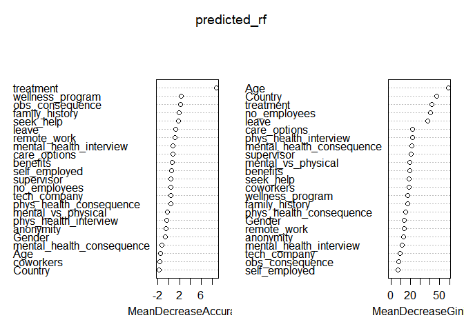
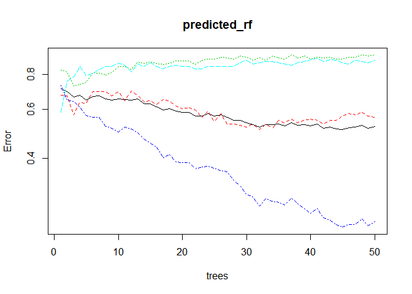
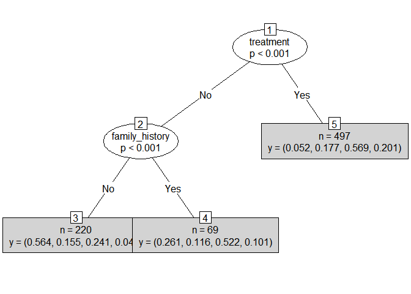

Mental\_Health\_Models
================
Niket
July 29, 2018

``` r
mhealth_2 <- read.csv(file.choose(), header = TRUE, na.strings = c("NA", "", " ", "."))
```

``` r
#install.packages('caret')
require(caret)
```

    ## Loading required package: caret

    ## Loading required package: lattice

    ## Loading required package: ggplot2

``` r
#install.packages('e1071')
require(e1071)
```

    ## Loading required package: e1071

    ## Warning: package 'e1071' was built under R version 3.4.3

``` r
mhealth_2$work_interfere <- as.factor(mhealth_2$work_interfere)
table(mhealth_2$work_interfere)
```

    ## 
    ##   0   1   2   3 
    ## 213 173 464 142

``` r
label_1 <- mhealth_2$work_interfere # our variable for classification
```

``` r
colnames(mhealth_2)
```

    ##  [1] "Age"                       "Gender"                   
    ##  [3] "Country"                   "self_employed"            
    ##  [5] "family_history"            "treatment"                
    ##  [7] "work_interfere"            "no_employees"             
    ##  [9] "remote_work"               "tech_company"             
    ## [11] "benefits"                  "care_options"             
    ## [13] "wellness_program"          "seek_help"                
    ## [15] "anonymity"                 "leave"                    
    ## [17] "mental_health_consequence" "phys_health_consequence"  
    ## [19] "coworkers"                 "supervisor"               
    ## [21] "mental_health_interview"   "phys_health_interview"    
    ## [23] "mental_vs_physical"        "obs_consequence"

``` r
set.seed(1234)
oneortwo <- sample(1:2 , length(mhealth_2$Age), replace = TRUE, prob = c(0.8, 0.2)) # generating random values and storing them
```

``` r
# create train data frame
train_2 <- mhealth_2[oneortwo == 1, -7]

# create test data frame
test_2 <- mhealth_2[oneortwo == 2, -7]

# create data frame to apply train and test upon
train_2_label <- label_1[oneortwo == 1]
test_2_label <- label_1[oneortwo == 2]
```

``` r
test_2 <- data.frame(test_2, test_2_label)
head(test_2)
```

    ##    Age Gender        Country self_employed family_history treatment
    ## 5   31   Male  United States            No             No        No
    ## 14  36   Male  United States            No            Yes        No
    ## 16  29 Female  United States            No            Yes       Yes
    ## 26  35 Female  United States            No            Yes       Yes
    ## 28  37   Male United Kingdom            No             No        No
    ## 29  32   Male United Kingdom            No             No        No
    ##    no_employees remote_work tech_company   benefits care_options
    ## 5       100-500         Yes          Yes        Yes           No
    ## 14     500-1000          No          Yes Don't know     Not sure
    ## 16       26-100          No          Yes        Yes     Not sure
    ## 26         6-25         Yes          Yes        Yes          Yes
    ## 28         6-25          No          Yes         No           No
    ## 29         6-25         Yes          Yes         No           No
    ##    wellness_program  seek_help  anonymity          leave
    ## 5        Don't know Don't know Don't know     Don't know
    ## 14               No Don't know Don't know     Don't know
    ## 16               No         No Don't know  Somewhat easy
    ## 26       Don't know Don't know Don't know     Don't know
    ## 28               No         No Don't know Very difficult
    ## 29               No         No Don't know     Don't know
    ##    mental_health_consequence phys_health_consequence    coworkers
    ## 5                         No                      No Some of them
    ## 14                        No                      No          Yes
    ## 16                        No                      No          Yes
    ## 26                        No                      No          Yes
    ## 28                       Yes                   Maybe Some of them
    ## 29                       Yes                     Yes Some of them
    ##      supervisor mental_health_interview phys_health_interview
    ## 5           Yes                     Yes                   Yes
    ## 14          Yes                      No                    No
    ## 16 Some of them                   Maybe                 Maybe
    ## 26          Yes                   Maybe                 Maybe
    ## 28           No                      No                 Maybe
    ## 29 Some of them                      No                 Maybe
    ##    mental_vs_physical obs_consequence test_2_label
    ## 5          Don't know              No            0
    ## 14         Don't know              No            0
    ## 16         Don't know              No            1
    ## 26                Yes              No            1
    ## 28                 No              No            2
    ## 29                 No              No            0

``` r
train_2 <- data.frame(train_2, train_2_label)
head(train_2)
```

    ##   Age Gender        Country self_employed family_history treatment
    ## 1  37 Female  United States            No             No       Yes
    ## 2  44   Male  United States            No             No        No
    ## 3  32   Male         Canada            No             No        No
    ## 4  31   Male United Kingdom            No            Yes       Yes
    ## 6  33   Male  United States            No            Yes        No
    ## 7  35 Female  United States            No            Yes       Yes
    ##     no_employees remote_work tech_company   benefits care_options
    ## 1           6-25          No          Yes        Yes     Not sure
    ## 2 More than 1000          No           No Don't know           No
    ## 3           6-25          No          Yes         No           No
    ## 4         26-100          No          Yes         No          Yes
    ## 6           6-25          No          Yes        Yes     Not sure
    ## 7            1-5         Yes          Yes         No           No
    ##   wellness_program  seek_help  anonymity              leave
    ## 1               No        Yes        Yes      Somewhat easy
    ## 2       Don't know Don't know Don't know         Don't know
    ## 3               No         No Don't know Somewhat difficult
    ## 4               No         No         No Somewhat difficult
    ## 6               No Don't know Don't know         Don't know
    ## 7               No         No         No Somewhat difficult
    ##   mental_health_consequence phys_health_consequence    coworkers
    ## 1                        No                      No Some of them
    ## 2                     Maybe                      No           No
    ## 3                        No                      No          Yes
    ## 4                       Yes                     Yes Some of them
    ## 6                        No                      No          Yes
    ## 7                     Maybe                   Maybe Some of them
    ##   supervisor mental_health_interview phys_health_interview
    ## 1        Yes                      No                 Maybe
    ## 2         No                      No                    No
    ## 3        Yes                     Yes                   Yes
    ## 4         No                   Maybe                 Maybe
    ## 6        Yes                      No                 Maybe
    ## 7         No                      No                    No
    ##   mental_vs_physical obs_consequence train_2_label
    ## 1                Yes              No             3
    ## 2         Don't know              No             1
    ## 3                 No              No             1
    ## 4                 No             Yes             3
    ## 6         Don't know              No             2
    ## 7         Don't know              No             2

### Random Forest

``` r
#install.packages('randomForest')
library(randomForest)
```

    ## Warning: package 'randomForest' was built under R version 3.4.3

    ## randomForest 4.6-12

    ## Type rfNews() to see new features/changes/bug fixes.

    ## 
    ## Attaching package: 'randomForest'

    ## The following object is masked from 'package:ggplot2':
    ## 
    ##     margin

``` r
set.seed(1234)
```

``` r
predicted_rf <- randomForest(train_2_label ~. , data = train_2, importance = TRUE, ntree = 50)
```

We want enough trees to stabilize the error but not so many that they over correlate the ensemble, which will lead to overfit so we keep ntree = 50.

``` r
varImpPlot(predicted_rf)
```

 Higher the value of Gini higher the homogeneity. So split occurs accordingly.

``` r
plot(predicted_rf, log="y")
```



``` r
library("party")
```

    ## Loading required package: grid

    ## Loading required package: mvtnorm

    ## Loading required package: modeltools

    ## Loading required package: stats4

    ## Loading required package: strucchange

    ## Loading required package: zoo

    ## 
    ## Attaching package: 'zoo'

    ## The following objects are masked from 'package:base':
    ## 
    ##     as.Date, as.Date.numeric

    ## Loading required package: sandwich

``` r
x <- ctree(train_2_label ~. , data = train_2)
plot(x, type = "simple")
```



``` r
prediction_rf <- predict(predicted_rf, test_2, type = 'class')
results_rf <- data.frame(prediction_rf, test_2$test_2_label)
confusionMatrix(table(results_rf))
```

    ## Confusion Matrix and Statistics
    ## 
    ##              test_2.test_2_label
    ## prediction_rf  0  1  2  3
    ##             0 24  4  7  0
    ##             1  1  3  0  0
    ##             2 20 35 79 25
    ##             3  0  1  6  1
    ## 
    ## Overall Statistics
    ##                                           
    ##                Accuracy : 0.5194          
    ##                  95% CI : (0.4489, 0.5894)
    ##     No Information Rate : 0.4466          
    ##     P-Value [Acc > NIR] : 0.02133         
    ##                                           
    ##                   Kappa : 0.2112          
    ##  Mcnemar's Test P-Value : NA              
    ## 
    ## Statistics by Class:
    ## 
    ##                      Class: 0 Class: 1 Class: 2 Class: 3
    ## Sensitivity            0.5333  0.06977   0.8587 0.038462
    ## Specificity            0.9317  0.99387   0.2982 0.961111
    ## Pos Pred Value         0.6857  0.75000   0.4969 0.125000
    ## Neg Pred Value         0.8772  0.80198   0.7234 0.873737
    ## Prevalence             0.2184  0.20874   0.4466 0.126214
    ## Detection Rate         0.1165  0.01456   0.3835 0.004854
    ## Detection Prevalence   0.1699  0.01942   0.7718 0.038835
    ## Balanced Accuracy      0.7325  0.53182   0.5785 0.499786

------------------------------------------------------------------------

### Generalized Boosted Regression Models(GBM)

``` r
fitControl <- trainControl(method = "cv", number = 10) #5folds) # cross validation (cv) is used to determine the optimum number of trees. 
```

``` r
tune_Grid <-  expand.grid(interaction.depth = 2, # interaction.depth = 2, shrinkage = 0.1 came from a bit of experimenting.
                            n.trees = 100,      # n.trees has to be high enough that it is clear the optimum number of trees is lower than the number estimated.
                            shrinkage = 0.1,
                            n.minobsinnode = 20)
```

``` r
set.seed(1234)

#install.packages('gbm')

predicted_gbm <- train(train_2_label ~. , data = train_2,
                 method = "gbm",
                 trControl = fitControl,
                 verbose = FALSE,
                 tuneGrid = tune_Grid)
```

    ## Warning: package 'gbm' was built under R version 3.4.3

    ## Loading required package: survival

    ## 
    ## Attaching package: 'survival'

    ## The following object is masked from 'package:caret':
    ## 
    ##     cluster

    ## Loading required package: splines

    ## Loading required package: parallel

    ## Loaded gbm 2.1.3

    ## 
    ## Attaching package: 'plyr'

    ## The following object is masked from 'package:modeltools':
    ## 
    ##     empty

    ## Warning in (function (x, y, offset = NULL, misc = NULL, distribution =
    ## "bernoulli", : variable 4: CountryAustria has no variation.

    ## Warning in (function (x, y, offset = NULL, misc = NULL, distribution =
    ## "bernoulli", : variable 10: CountryChina has no variation.

    ## Warning in (function (x, y, offset = NULL, misc = NULL, distribution =
    ## "bernoulli", : variable 29: CountryPhilippines has no variation.

    ## Warning in (function (x, y, offset = NULL, misc = NULL, distribution =
    ## "bernoulli", : variable 34: CountrySlovenia has no variation.

    ## Warning in (function (x, y, offset = NULL, misc = NULL, distribution =
    ## "bernoulli", : variable 4: CountryAustria has no variation.

    ## Warning in (function (x, y, offset = NULL, misc = NULL, distribution =
    ## "bernoulli", : variable 14: CountryDenmark has no variation.

    ## Warning in (function (x, y, offset = NULL, misc = NULL, distribution =
    ## "bernoulli", : variable 19: CountryHungary has no variation.

    ## Warning in (function (x, y, offset = NULL, misc = NULL, distribution =
    ## "bernoulli", : variable 29: CountryPhilippines has no variation.

    ## Warning in (function (x, y, offset = NULL, misc = NULL, distribution =
    ## "bernoulli", : variable 4: CountryAustria has no variation.

    ## Warning in (function (x, y, offset = NULL, misc = NULL, distribution =
    ## "bernoulli", : variable 6: CountryBosnia and Herzegovina has no variation.

    ## Warning in (function (x, y, offset = NULL, misc = NULL, distribution =
    ## "bernoulli", : variable 29: CountryPhilippines has no variation.

    ## Warning in (function (x, y, offset = NULL, misc = NULL, distribution =
    ## "bernoulli", : variable 4: CountryAustria has no variation.

    ## Warning in (function (x, y, offset = NULL, misc = NULL, distribution =
    ## "bernoulli", : variable 29: CountryPhilippines has no variation.

    ## Warning in (function (x, y, offset = NULL, misc = NULL, distribution =
    ## "bernoulli", : variable 38: CountryThailand has no variation.

    ## Warning in (function (x, y, offset = NULL, misc = NULL, distribution =
    ## "bernoulli", : variable 4: CountryAustria has no variation.

    ## Warning in (function (x, y, offset = NULL, misc = NULL, distribution =
    ## "bernoulli", : variable 29: CountryPhilippines has no variation.

    ## Warning in (function (x, y, offset = NULL, misc = NULL, distribution =
    ## "bernoulli", : variable 4: CountryAustria has no variation.

    ## Warning in (function (x, y, offset = NULL, misc = NULL, distribution =
    ## "bernoulli", : variable 13: CountryCzech Republic has no variation.

    ## Warning in (function (x, y, offset = NULL, misc = NULL, distribution =
    ## "bernoulli", : variable 17: CountryGeorgia has no variation.

    ## Warning in (function (x, y, offset = NULL, misc = NULL, distribution =
    ## "bernoulli", : variable 26: CountryMoldova has no variation.

    ## Warning in (function (x, y, offset = NULL, misc = NULL, distribution =
    ## "bernoulli", : variable 29: CountryPhilippines has no variation.

    ## Warning in (function (x, y, offset = NULL, misc = NULL, distribution =
    ## "bernoulli", : variable 4: CountryAustria has no variation.

    ## Warning in (function (x, y, offset = NULL, misc = NULL, distribution =
    ## "bernoulli", : variable 11: CountryColombia has no variation.

    ## Warning in (function (x, y, offset = NULL, misc = NULL, distribution =
    ## "bernoulli", : variable 29: CountryPhilippines has no variation.

    ## Warning in (function (x, y, offset = NULL, misc = NULL, distribution =
    ## "bernoulli", : variable 4: CountryAustria has no variation.

    ## Warning in (function (x, y, offset = NULL, misc = NULL, distribution =
    ## "bernoulli", : variable 29: CountryPhilippines has no variation.

    ## Warning in (function (x, y, offset = NULL, misc = NULL, distribution =
    ## "bernoulli", : variable 41: CountryZimbabwe has no variation.

    ## Warning in (function (x, y, offset = NULL, misc = NULL, distribution =
    ## "bernoulli", : variable 4: CountryAustria has no variation.

    ## Warning in (function (x, y, offset = NULL, misc = NULL, distribution =
    ## "bernoulli", : variable 24: CountryJapan has no variation.

    ## Warning in (function (x, y, offset = NULL, misc = NULL, distribution =
    ## "bernoulli", : variable 29: CountryPhilippines has no variation.

    ## Warning in (function (x, y, offset = NULL, misc = NULL, distribution =
    ## "bernoulli", : variable 31: CountryPortugal has no variation.

    ## Warning in (function (x, y, offset = NULL, misc = NULL, distribution =
    ## "bernoulli", : variable 4: CountryAustria has no variation.

    ## Warning in (function (x, y, offset = NULL, misc = NULL, distribution =
    ## "bernoulli", : variable 29: CountryPhilippines has no variation.

    ## Warning in (function (x, y, offset = NULL, misc = NULL, distribution =
    ## "bernoulli", : variable 4: CountryAustria has no variation.

    ## Warning in (function (x, y, offset = NULL, misc = NULL, distribution =
    ## "bernoulli", : variable 29: CountryPhilippines has no variation.

``` r
prediction_gbm <- predict(predicted_gbm, test_2, type = "raw") 
results_gbm <- data.frame(prediction_gbm, test_2$test_2_label)
confusionMatrix(table(results_gbm))
```

    ## Confusion Matrix and Statistics
    ## 
    ##               test_2.test_2_label
    ## prediction_gbm  0  1  2  3
    ##              0 32  8  9  2
    ##              1  1  2  3  2
    ##              2 12 31 78 22
    ##              3  0  2  2  0
    ## 
    ## Overall Statistics
    ##                                          
    ##                Accuracy : 0.5437         
    ##                  95% CI : (0.473, 0.6131)
    ##     No Information Rate : 0.4466         
    ##     P-Value [Acc > NIR] : 0.003225       
    ##                                          
    ##                   Kappa : 0.2703         
    ##  Mcnemar's Test P-Value : 1.421e-08      
    ## 
    ## Statistics by Class:
    ## 
    ##                      Class: 0 Class: 1 Class: 2 Class: 3
    ## Sensitivity            0.7111 0.046512   0.8478  0.00000
    ## Specificity            0.8820 0.963190   0.4298  0.97778
    ## Pos Pred Value         0.6275 0.250000   0.5455  0.00000
    ## Neg Pred Value         0.9161 0.792929   0.7778  0.87129
    ## Prevalence             0.2184 0.208738   0.4466  0.12621
    ## Detection Rate         0.1553 0.009709   0.3786  0.00000
    ## Detection Prevalence   0.2476 0.038835   0.6942  0.01942
    ## Balanced Accuracy      0.7965 0.504851   0.6388  0.48889

------------------------------------------------------------------------

### XGBoost

``` r
# install.packages('xgboost')
library(xgboost)
```

    ## Warning: package 'xgboost' was built under R version 3.4.3

``` r
library(readr)
library(stringr)
```

    ## 
    ## Attaching package: 'stringr'

    ## The following object is masked from 'package:strucchange':
    ## 
    ##     boundary

``` r
# create train data frame
train_3 <- mhealth_2[oneortwo == 1, -7]

# create test data frame
test_3 <- mhealth_2[oneortwo == 2, -7]

# create data frame to apply train and test upon
train_3_label <- label_1[oneortwo == 1]
test_3_label <- label_1[oneortwo == 2]

# convert every variable to numeric, even the integer variables
train_3 <- as.data.frame(lapply(train_3, as.numeric))
test_3 <- as.data.frame(lapply(test_3, as.numeric))
```

We must convert our data type to numeric, otherwise algorithm doesn’t work.

``` r
# convert data to xgboost format
data.train_3 <- xgb.DMatrix(data = data.matrix(train_3[, 1:ncol(train_3)]), label = train_3_label)
data.test_3 <- xgb.DMatrix(data = data.matrix(test_3[, 1:ncol(test_3)]), label = test_3_label)
```

``` r
watchlist <- list(train  = data.train_3, test = data.test_3)
```

``` r
parameters <- list(
    # General Parameters
    booster            = "gbtree",          # default = "gbtree"           # gbtree (tree based) or gblinear (linear function)
    silent             = 0,                 # default = 0                  # silent = 0 will stop results from displaying
    # Booster Parameters
    eta                = 0.3,               # default = 0.3, range: [0,1]  # Low eta value means model is more robust to overfitting.
    gamma              = 0,                 # default = 0,   range: [0,∞]  # Larger the gamma more conservative the algorithm is.
    max_depth          = 2,                 # default = 6,   range: [1,∞]  # less depth so to avoid overfitting
    min_child_weight   = 1,                 # default = 1,   range: [0,∞]  # It might help in logistic regression when class is extremely imbalanced. 
    subsample          = 1,                 # default = 1,   range: (0,1]  # 0.5 means that XGBoost randomly collected half of the data instances to grow trees, this will prevent overfitting.
    colsample_bytree   = 1,                 # default = 1,   range: (0,1]
    colsample_bylevel  = 1,                 # default = 1,   range: (0,1]
    lambda             = 1,                 # default = 1
    alpha              = 0,                 # default = 0
    # Task Parameters
    objective          = "multi:softmax",   # default = "reg:linear"
    eval_metric        = "mlogloss",
    num_class          = 20,
    seed               = 1234               # reproducability seed
    )
```

``` r
predicted_xgb <- xgb.train(parameters, data.train_3, nrounds = 100, watchlist) # nrounds is like ntrees 
```

    ## [1]  train-mlogloss:2.052514 test-mlogloss:2.081929 
    ## [2]  train-mlogloss:1.788711 test-mlogloss:1.829371 
    ## [3]  train-mlogloss:1.616083 test-mlogloss:1.664378 
    ## [4]  train-mlogloss:1.492195 test-mlogloss:1.547607 
    ## [5]  train-mlogloss:1.399216 test-mlogloss:1.464250 
    ## [6]  train-mlogloss:1.329542 test-mlogloss:1.401058 
    ## [7]  train-mlogloss:1.271765 test-mlogloss:1.350246 
    ## [8]  train-mlogloss:1.225357 test-mlogloss:1.311426 
    ## [9]  train-mlogloss:1.187953 test-mlogloss:1.283532 
    ## [10] train-mlogloss:1.156044 test-mlogloss:1.257804 
    ## [11] train-mlogloss:1.127371 test-mlogloss:1.239363 
    ## [12] train-mlogloss:1.105706 test-mlogloss:1.222635 
    ## [13] train-mlogloss:1.085598 test-mlogloss:1.204146 
    ## [14] train-mlogloss:1.069471 test-mlogloss:1.194994 
    ## [15] train-mlogloss:1.054634 test-mlogloss:1.183040 
    ## [16] train-mlogloss:1.042720 test-mlogloss:1.174196 
    ## [17] train-mlogloss:1.031738 test-mlogloss:1.167607 
    ## [18] train-mlogloss:1.021428 test-mlogloss:1.164613 
    ## [19] train-mlogloss:1.011790 test-mlogloss:1.159549 
    ## [20] train-mlogloss:1.003128 test-mlogloss:1.156713 
    ## [21] train-mlogloss:0.996120 test-mlogloss:1.153699 
    ## [22] train-mlogloss:0.988758 test-mlogloss:1.149755 
    ## [23] train-mlogloss:0.982064 test-mlogloss:1.149867 
    ## [24] train-mlogloss:0.976748 test-mlogloss:1.146475 
    ## [25] train-mlogloss:0.970659 test-mlogloss:1.144814 
    ## [26] train-mlogloss:0.965129 test-mlogloss:1.143593 
    ## [27] train-mlogloss:0.960593 test-mlogloss:1.145172 
    ## [28] train-mlogloss:0.956126 test-mlogloss:1.144268 
    ## [29] train-mlogloss:0.952927 test-mlogloss:1.144874 
    ## [30] train-mlogloss:0.948255 test-mlogloss:1.143381 
    ## [31] train-mlogloss:0.944644 test-mlogloss:1.140694 
    ## [32] train-mlogloss:0.940811 test-mlogloss:1.139695 
    ## [33] train-mlogloss:0.935711 test-mlogloss:1.140743 
    ## [34] train-mlogloss:0.932236 test-mlogloss:1.141688 
    ## [35] train-mlogloss:0.929328 test-mlogloss:1.143920 
    ## [36] train-mlogloss:0.926213 test-mlogloss:1.143879 
    ## [37] train-mlogloss:0.924100 test-mlogloss:1.145076 
    ## [38] train-mlogloss:0.921166 test-mlogloss:1.144502 
    ## [39] train-mlogloss:0.917689 test-mlogloss:1.145567 
    ## [40] train-mlogloss:0.914502 test-mlogloss:1.146557 
    ## [41] train-mlogloss:0.911480 test-mlogloss:1.145626 
    ## [42] train-mlogloss:0.907983 test-mlogloss:1.147674 
    ## [43] train-mlogloss:0.905929 test-mlogloss:1.146516 
    ## [44] train-mlogloss:0.902990 test-mlogloss:1.147425 
    ## [45] train-mlogloss:0.900280 test-mlogloss:1.149315 
    ## [46] train-mlogloss:0.897451 test-mlogloss:1.150770 
    ## [47] train-mlogloss:0.893931 test-mlogloss:1.151991 
    ## [48] train-mlogloss:0.891581 test-mlogloss:1.152505 
    ## [49] train-mlogloss:0.889214 test-mlogloss:1.153972 
    ## [50] train-mlogloss:0.887078 test-mlogloss:1.155299 
    ## [51] train-mlogloss:0.885501 test-mlogloss:1.155069 
    ## [52] train-mlogloss:0.883340 test-mlogloss:1.155533 
    ## [53] train-mlogloss:0.880773 test-mlogloss:1.155482 
    ## [54] train-mlogloss:0.877777 test-mlogloss:1.155238 
    ## [55] train-mlogloss:0.874456 test-mlogloss:1.155724 
    ## [56] train-mlogloss:0.871328 test-mlogloss:1.156890 
    ## [57] train-mlogloss:0.869184 test-mlogloss:1.160302 
    ## [58] train-mlogloss:0.867344 test-mlogloss:1.160202 
    ## [59] train-mlogloss:0.864616 test-mlogloss:1.161086 
    ## [60] train-mlogloss:0.862939 test-mlogloss:1.163364 
    ## [61] train-mlogloss:0.860266 test-mlogloss:1.165082 
    ## [62] train-mlogloss:0.857392 test-mlogloss:1.163190 
    ## [63] train-mlogloss:0.855349 test-mlogloss:1.162531 
    ## [64] train-mlogloss:0.852721 test-mlogloss:1.165195 
    ## [65] train-mlogloss:0.850645 test-mlogloss:1.166848 
    ## [66] train-mlogloss:0.848390 test-mlogloss:1.167470 
    ## [67] train-mlogloss:0.846417 test-mlogloss:1.168097 
    ## [68] train-mlogloss:0.844437 test-mlogloss:1.169823 
    ## [69] train-mlogloss:0.842426 test-mlogloss:1.171594 
    ## [70] train-mlogloss:0.840521 test-mlogloss:1.171308 
    ## [71] train-mlogloss:0.838910 test-mlogloss:1.171229 
    ## [72] train-mlogloss:0.837006 test-mlogloss:1.170766 
    ## [73] train-mlogloss:0.834804 test-mlogloss:1.170969 
    ## [74] train-mlogloss:0.833385 test-mlogloss:1.171220 
    ## [75] train-mlogloss:0.831355 test-mlogloss:1.171519 
    ## [76] train-mlogloss:0.828808 test-mlogloss:1.173362 
    ## [77] train-mlogloss:0.827177 test-mlogloss:1.173850 
    ## [78] train-mlogloss:0.825544 test-mlogloss:1.174093 
    ## [79] train-mlogloss:0.823312 test-mlogloss:1.175166 
    ## [80] train-mlogloss:0.821313 test-mlogloss:1.175065 
    ## [81] train-mlogloss:0.819382 test-mlogloss:1.176813 
    ## [82] train-mlogloss:0.817651 test-mlogloss:1.180245 
    ## [83] train-mlogloss:0.815473 test-mlogloss:1.182135 
    ## [84] train-mlogloss:0.813161 test-mlogloss:1.181255 
    ## [85] train-mlogloss:0.810764 test-mlogloss:1.181876 
    ## [86] train-mlogloss:0.809492 test-mlogloss:1.183840 
    ## [87] train-mlogloss:0.807125 test-mlogloss:1.182135 
    ## [88] train-mlogloss:0.804961 test-mlogloss:1.182376 
    ## [89] train-mlogloss:0.803884 test-mlogloss:1.183940 
    ## [90] train-mlogloss:0.801680 test-mlogloss:1.185575 
    ## [91] train-mlogloss:0.799756 test-mlogloss:1.184658 
    ## [92] train-mlogloss:0.797488 test-mlogloss:1.186623 
    ## [93] train-mlogloss:0.795936 test-mlogloss:1.186432 
    ## [94] train-mlogloss:0.794099 test-mlogloss:1.188372 
    ## [95] train-mlogloss:0.792114 test-mlogloss:1.187798 
    ## [96] train-mlogloss:0.790204 test-mlogloss:1.188352 
    ## [97] train-mlogloss:0.788546 test-mlogloss:1.187673 
    ## [98] train-mlogloss:0.786834 test-mlogloss:1.187397 
    ## [99] train-mlogloss:0.784851 test-mlogloss:1.187922 
    ## [100]    train-mlogloss:0.782873 test-mlogloss:1.186337

``` r
prediction_xgb <- predict(predicted_xgb, data.test_3)
table(prediction_xgb)
```

    ## prediction_xgb
    ##   1   2   3   4 
    ##  40  12 140  14

Values have to be changed to 0 1 2 and 3

``` r
prediction_xgb[prediction_xgb == 1] <- 0
prediction_xgb[prediction_xgb == 2] <- 1
prediction_xgb[prediction_xgb == 3] <- 2
prediction_xgb[prediction_xgb == 4] <- 3
```

``` r
results_xgb <- data.frame(prediction_xgb, test_3_label)
confusionMatrix(table(results_xgb))
```

    ## Confusion Matrix and Statistics
    ## 
    ##               test_3_label
    ## prediction_xgb  0  1  2  3
    ##              0 25  5  8  2
    ##              1  4  3  3  2
    ##              2 15 32 75 18
    ##              3  1  3  6  4
    ## 
    ## Overall Statistics
    ##                                           
    ##                Accuracy : 0.5194          
    ##                  95% CI : (0.4489, 0.5894)
    ##     No Information Rate : 0.4466          
    ##     P-Value [Acc > NIR] : 0.02133         
    ##                                           
    ##                   Kappa : 0.2412          
    ##  Mcnemar's Test P-Value : 1.144e-05       
    ## 
    ## Statistics by Class:
    ## 
    ##                      Class: 0 Class: 1 Class: 2 Class: 3
    ## Sensitivity            0.5556  0.06977   0.8152  0.15385
    ## Specificity            0.9068  0.94479   0.4298  0.94444
    ## Pos Pred Value         0.6250  0.25000   0.5357  0.28571
    ## Neg Pred Value         0.8795  0.79381   0.7424  0.88542
    ## Prevalence             0.2184  0.20874   0.4466  0.12621
    ## Detection Rate         0.1214  0.01456   0.3641  0.01942
    ## Detection Prevalence   0.1942  0.05825   0.6796  0.06796
    ## Balanced Accuracy      0.7312  0.50728   0.6225  0.54915

------------------------------------------------------------------------

All the models are nearly 50% accurate
